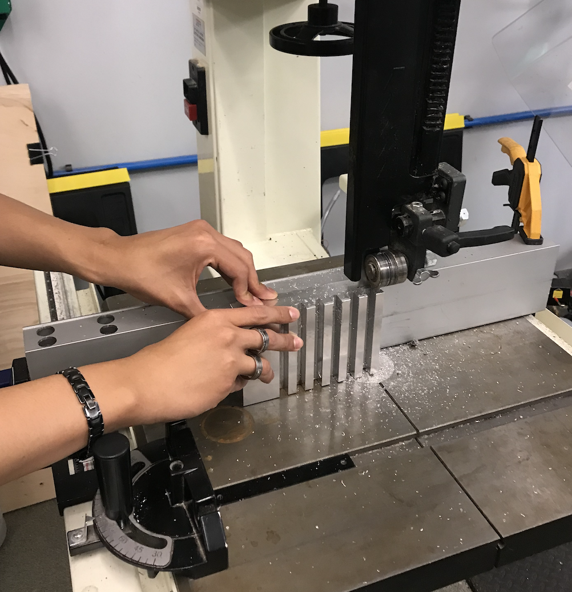
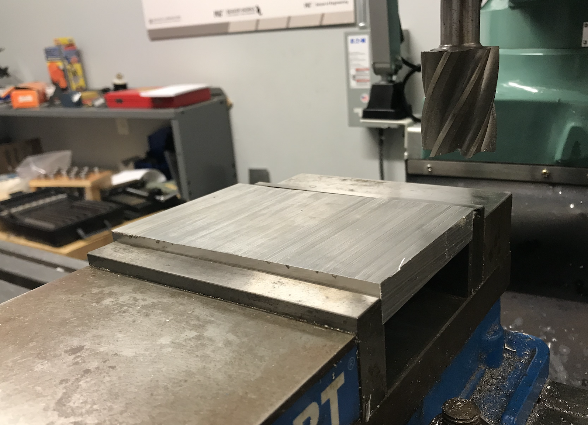
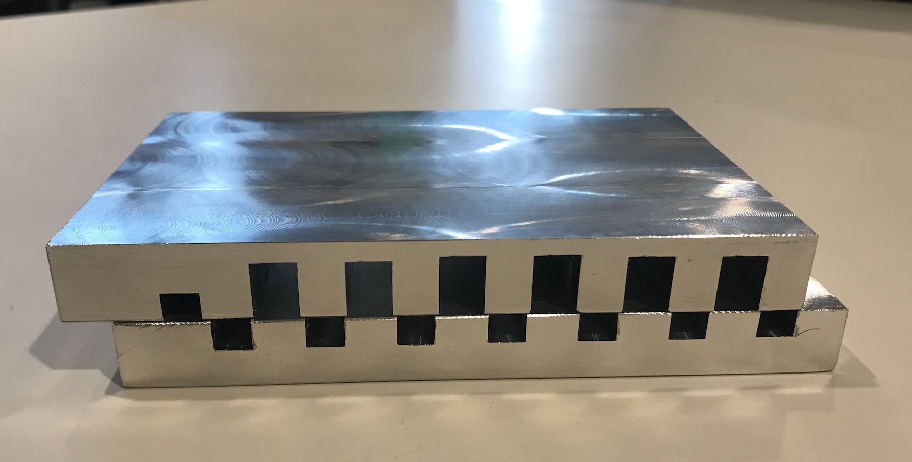

# Design Thinking and Rapid Prototyping Term Project
### Lucas Marden
[Home](https://lmarden.github.io/rapid-prototyping/)

### Week 10
In the 10th week of class, we narrowed the scope of our project further. It had become clear during the mid-review that we should be striving to finish a slightly imperfect model of the solar cooker by the end of the semester, rather than spending all of our time working on paper to design a more perfect machine. To achieve this, the energy storage team split into two groups: one looking at how to transfer heat, and one figuring out how to stop the transfer heat. Given my experience on the milling machine and generally working on the heat transfer mechanism, I opted to join the heat transfer team.

#### Heat Transfer Team
Based on the recommendations of the panel at our mid-review, we decided to opt for a heat transfer mechanism that had originally been dismissed. The mechanism is described in great detail in my post from [Week 6](https://lmarden.github.io/rapid-prototyping/Week_6/), called the Horizontal-Motion, Solid-State Heat Transfer Mechanism.

To create this mechanism, we started with the previous prototype. We agreed that the previous prototype was probably too thick for our purposes, so we decided to cut it in half with a bandsaw. This would allow us to cut slots in the other half, so that the two halves can sit nicely on top of each other. We made the decision to cut thinner slots in the opposite half, so that when the two pieces sit together, they can't mesh together. This will cause some heat transfer to occur even in the fully "off" state, but it was decided that this was prerable over a mechanism that gets stuck easily. A few steps of the process are pictured below:

##### Cutting the prototype with the bandsaw:

##### Flattening the cut face of the prototype:

##### The current prototype:

