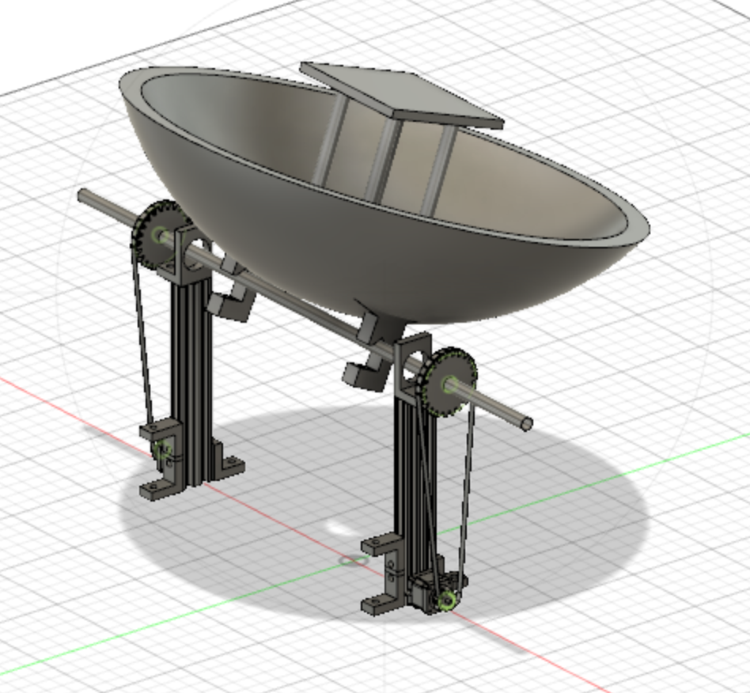

# Design Thinking and Rapid Prototyping Term Project
### Lucas Marden
[Home](https://lmarden.github.io/rapid-prototyping/)

### Week 12
This week focused even more closely on finishing up all prototyping efforts, and I branched out to help with some other sub-projects and learn new skills.

#### Heat Transfer Mechanism Prototype
I was not in class for the first class of the week, but one of my classmates finished cutting the last slot one the heat transfer mechanism, which I mentioned in my blog post for [Week 11](https://lmarden.github.io/rapid-prototyping/Week_11/). When I got back to class, I cleaned up the block again with soap and then used a [file](https://www.amazon.com/AZUNO-Premium-Forged-Triangle-Half-Round/dp/B087TPVZS3/ref=sr_1_2_sspa?keywords=metal+file&qid=1638159947&sr=8-2-spons&psc=1&spLa=ZW5jcnlwdGVkUXVhbGlmaWVyPUEzNDFXUkdTTDhTMDIwJmVuY3J5cHRlZElkPUEwMTM3MTcxMkQwOEU4WkxGUTEyWiZlbmNyeXB0ZWRBZElkPUEwNjEzNTI2U1NVSkUwRDZLNVBUJndpZGdldE5hbWU9c3BfYXRmJmFjdGlvbj1jbGlja1JlZGlyZWN0JmRvTm90TG9nQ2xpY2s9dHJ1ZQ==)  and a [deburring tool](https://www.amazon.com/Deburring-YUFUTOL-Removing-Aluminum-Fiberboard/dp/B07KS1HPN6/ref=asc_df_B07KS1HPN6/?tag=hyprod-20&linkCode=df0&hvadid=309807921328&hvpos=&hvnetw=g&hvrand=7524761374497326613&hvpone=&hvptwo=&hvqmt=&hvdev=c&hvdvcmdl=&hvlocint=&hvlocphy=9002000&hvtargid=pla-636386919314&psc=1).

#### Other Projects
Once I finished with the heat transfer mechanism, I had some time to help out on other projects. I discussed the CAD model (pictured below) with some other students who have been working on modelling, so that I could get fully caught up on the latest design. This also let me suggest some new ideas on how to attach the reflector to the current enclosure for the battery, and some ways to modify the enclosure to enable the original attachment mechanism to work.

I also learned how to use the later cutter and helped cut out some pieces for the gear assembly at the base of the cooker, which allows for azimuthal rotation (around the vertical axis). Specifically I cut out a large ring of delrin (a type of plastic) and a gear used for the base. The drawings are pictured below:

  

#### Skills Checklist
One of the primary goals of the class is to learn some skills in prototyping, so I figured I'd look back to see the progress I've made since the beginning of the semester. Pulling from the skills checklist provided [here](https://nathanmelenbrink.github.io/rapid-prototyping/skills/index.html), I have assembled my current checklist, including only skills that I have practiced in this class. I had done some of the skills before this class (use of a hand drill, bandsaw, and drill press). I have also spent a lot of time this semester learning how to operate a milling machine and improving my capabilities, though that tool is not technically on this list. Here is my current progress:

 - [x] Layout work
 - [ ] Use of a hand drill
 - [x] Use of a drill press
 - [x] Use of a bandsaw
 - [x] Laser cutting
 - [ ] 3D Printing
 - [ ] Sheet metal work
 - [x] CAD Modelling
