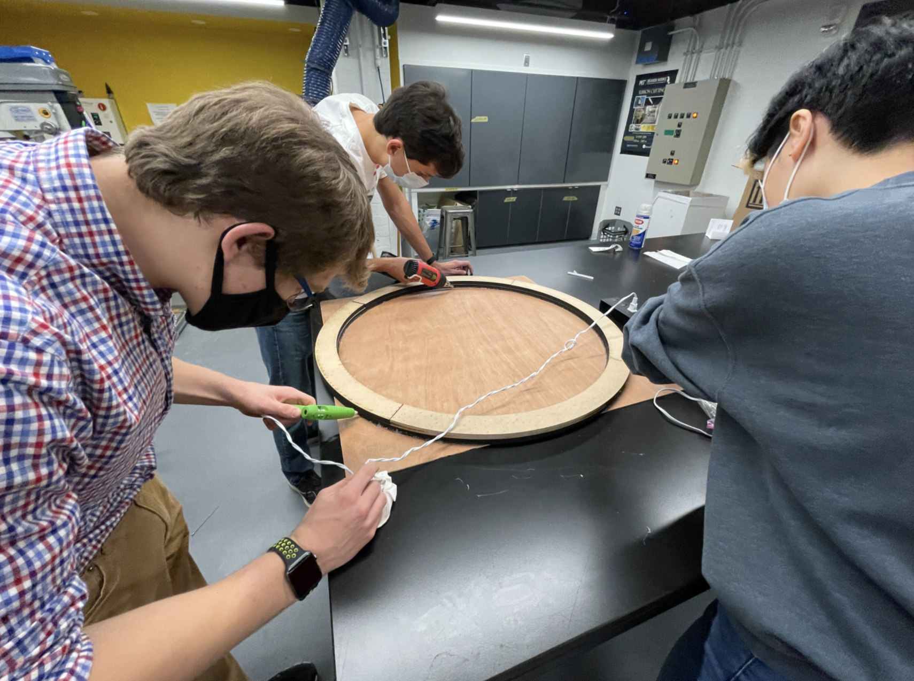

# Design Thinking and Rapid Prototyping Term Project
### Lucas Marden
[Home](https://lmarden.github.io/rapid-prototyping/)

### Week 13
In the final week of our class, everyone got to work solving all of the miscellaneous problems that still existed with the solar cooker. I worked on a few different projects, including building the mirror, designing and building a mounting system for the secondary mirror, testing and aligning the mirror set up, and mounting the mirror setup to the base.

#### Building the Mirror
I moved away from the heat trasnfer mechanism project to help with building the mirror. The mirror is made of a mylar sheet which is mounted to fiberglass backing and inflated with a pump in order to give it a rounded shape. Epoxy is used to allow the fiberglass to form a stiff backing after curing. This process allowed me to learn a fair number of new skills: spraying polyurethane, saftey when working with epoxy, etc. The process is documented below:

First, pieces of medium-density fiberboard (MDF) were laser cut into quarter-circle pieces. We cleaned these off with wet paper towels to ensure a good bond with both the hot glue and epoxy:

The MDF pieces were then hot glued to a board of plywood. This is done to keep the circle as flat as possible, so as to wind up with a more perfect mirror as the final product:

After, polyurethane was applied to the whole surface and we allowed everything to dry. Then, a sheet of mylar was attached to the MDF with epoxy, then allowed to cure. After curing for a few days, the mylar was inflated:

 

With the mylar inflated, the fiberglass backing was added to ensure that the mirror had a strong, rigid backing:

#### Mounting the Secondary Mirror
My next task was one that had largely been pushed off throughout the rest of the semester. There was always some faint idea that the secondary mirror had to somehow be attached to the primary (larger) mirror, but nobody really put much thought into how that would be done. I helped decide on a concrete plan (well, actually I guess it was more steel, but either way it was very solid).

The idea was to drill holes through the outside ring of the primary mirror, and use these holes to bolt three steel tubes to the ring. These tubes were about 6 feet long at the beginning of the process. The plan was to attach the tubes normal to the surface of the ring, which is ideal for the other primary mirror (which has raised surfaces, which would get in the way of any supports that were not normal to the outside of the mirror). We didn't have much of a plan on how to attached the secondary mirror to these tubes, but nonetheless we staerted construction.

The first task was to thread the end of each tube, so that we could use bolts to attach them to the mirror. This was done on our lathe; the lathe wasn't actually spinning, just used to hold the tubes in place while we used a tap to thread the holes. As it turns out, 12-28 is an obscure tap size, and we couldn't find any bolts for the original threads. Luckily, one of our instructors was able to thread the other side of each tube with a 12-24 tap, and we used these in the final assembly.

After the tubes were ready, we used the drill press to drill through the MDF ring of the primary mirror, at 120º increments. The tubes were then attached to the mirror, and cut to length with a [pipe cutter](https://www.homedepot.com/p/RIDGID-101-Tube-Cutter-1-4-in-to-1-1-8-in-40617/100075014). We also attached plastic tubes with set screws to the outside of each tube, as a way to manipulate the height and angle of the secondary mirror.

After a few attempts and a new laser cut acrylic secondary mirror mount, we were able to assemble everything. Here is a picture of the primary mirror as we attach the secondary mirror with hot glue to its acrylic mount:

#### Testing the Mirror Setup
Once the mirror setup was built, we spent some time testing it. We could not do a perfect test (which would involve parallel light rays, i.e. sunlight), but we did our best with a floodlight. Our testing setup is shown below:

 

The major takeaway from the test was that the focal lengths of both mirrors need to be more accurately defined/known. We did manage to reflect light off both mirrors and through the hole in the primary mirror, but it appeared no brighter than the light traveling directly from the floodlight to the wall. Better alignment and more perfect mirrors would certainly help solve this problem, and are a significant area for improvement if this project is continued. Some light bouncing off both mirrors is documented here:

#### Mounting the Mirror to the Base
Despite our imperfect attempts to bounce light off both mirrors, we wanted to assemble the whole cooker. This required some more drilling through the frame of the mirror, as well as some assembly with parts designed and manufactured by other teams. Largely, this effort was fairly easy, and everything went off mostly without a hitch. The final product of this semester is shown below:

#### Closing Thoughts
Though we don't really have a working prototype right now, tt feels good to have gotten to this point. There was a lot of team effort throughout the semester, especially in the last few weeks. I think we have fleshed out the idea pretty well, generated a lot of information and documentation about the solar cooker and all of its components, and provided a very good base for future work. Personally, I enjoyed the hands-on aspect of this class; I got more exposure to machining and working with tools than I have in any other class or job in the past, which I really enjoyed. I also appreciated being able to have a significant say in the direction of my work and the project as a whole. Taking a look at my skills checklist:

 - [x] Layout work
 - [x] Use of a hand drill
 - [x] Use of a drill press
 - [x] Use of a bandsaw
 - [x] Laser cutting
 - [ ] 3D Printing
 - [ ] Sheet metal work
 - [x] CAD Modelling

I have learned a lot this semester, even though there are a few skills I would still like to learn/develop more fully. I think this has given me a better understanding of design and prototyping, as well as the general trends and challenges within project-based courses like this one.

I am excited to see the progress that is made on the solar cooker in the future. Though I don't believe it represents a viable solution to climate change issues associated with cooking, it is a great way to learn about design and manufacturing. I would propose large-scale solar energy collection via solar panels to power electric stoves as a more realistic sustainable cooking solution, but such a project is simply too large for a class project. This was a great project to help develop skills and think about the serious problems of our generation, and give students the opportunity to get familiar with challenges in engineering and design projects.

I would like to thank the instructors for their continued support and dedication throughout the semester; this class was great and I am excited to see where the teaching staff takes it in future semesters.
