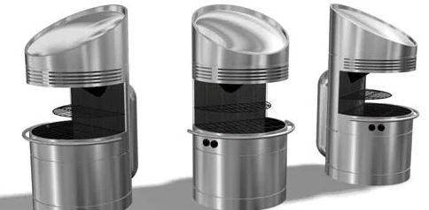

# Design Thinking and Rapid Prototyping Term Project
### Lucas Marden

## Week 4
In the fourth week, we narrowed down to a specific project, though not all of the details have been worked out yet. The class discussed the methods of energy collection, storage, and use at quite some length, that we had spent the third week brainstorming and researching. By the end of the group brainstorm session, we had the following criteria/outline for the project:

**Audience**: MIT Students   
**Energy Source / Collection Method**: Solar / Direct Heating   
**Energy Storage**: Large block or bath of a solid or liquid    
**Use**: Cooking     

To get started on the specifics of the project, we have also asked ourselves and started to answer the following questions:

1. What are some precedents for renewable, on-demand, and off-grid cooking? How do they collect, store, and use energy?
2. What temperature ramges are involved in different cooking techniques (e.g. for grilling vs. searing vs. baking vs. boiling) 
3. Which material(s) should be used for energy storage?
4. How can we ensure that the heat storage container can transfer heat to the cooking surface quickly enough to reach cooking temperatures?

Some brief preliminary answers are provided below. I joined the materials / energy storage team, so my research so far has mainly been focus on questions 1 and 3.

##### Precedents
[Phase Change Thermal Storage](https://www.sciencedirect.com/science/article/pii/S0038092X21002280): A paper describing the storage of thermal energy by heating erythritol. The energy is released by forcing crystallization of the material, allowing for high temperature cooking, even after sunset. Energy is collected using a solar panel, and the erythritol degrades after a few months of cycling.    

[Performance Comparison of Erythritol and Xylitol](https://www.sciencedirect.com/science/article/abs/pii/S245190491930246X): Explores the performance differences between erythritol (the material mentioned above) and another compound, xylitol. The materials are tested in a "double spiral coil latent heat storage system".

[Wilson Solar Grill](https://solarcooking.fandom.com/wiki/Wilson_Solar_Grill): Description of a solar grill designed and manufactured by former MIT Mechanical Engineering Professor David Wilson, that uses lithium nitrate for latent heat storage, allowing for cooking after sundown. The lithium nitrate is heated directly by sunlight with a [Fresnel Lens](https://en.wikipedia.org/wiki/Fresnel_lens).   

[Solar Thermal Fuels](https://tatacenter.mit.edu/portfolio/solar-thermal-fuels/): A look into some current work from MIT Materials Science Department Head Jeffrey Grossman, studying materials that store thermal energy for up to a few days, which can then release heat in order to be used for cooking.

##### Temperature Ranges
There are a wide ranges of optimal cooking temperatures, for different techniques. This [article](https://www.webstaurantstore.com/article/454/types-of-cooking-methods.html) lists some of these ranges. For dry cooking (broiling, grilling, roasting, baking, sauteing), temperatures of 300&deg;F or higher are optimal. The correct temperature depends on the type of food (meat vs. bread vs. vegetables, etc.) but dry heat cooking requires higher temperatures than other types of cooking. Moist heat cooking can be done at cooler temperatures. For this method, the temperatures are more dependent on the cooking technique. For example, poaching is done at around 160&deg;F, while simmering is closer to 195&deg;F. Boiling and steaming both require water to boil, which occurs at 212&deg;F. There are some more complicated ways to combine dry and moist cooking methods, but these basic techniques will likely be more than the extent of our cooking system. Since the proposed cooking device is intended to be a shared item on campus, it must be relatively simple to operate, so there is no reason to worry about extremely niche or complicated cooking techniques.

##### Materials
Before we started looking into specific materials, my group discussed some necessary and/or preferable properties for the material used for latent heat storage. We came up with the following list:   
+ heat capacity: high
+ thermal conductivity: high
+ flammability: low
+ toxicity: low
+ boiling/melting/phase change temp (depending on material phase): within temperature range of chosen cooking method

##### Heat Transfer
Though we have not yet fully decided on a heat transfer system, we can say the following: the system must be able to both transfer heat quickly, and there must be a way to control the output temperature. To solve the first challenge, one might consider some sort of coil system, as in some of the precedent systems. One could also imagine a capillary system of small pipes or conducting materials that pass through a larger block/bath of the heat storage material. As for the temperature control, one could control flow rate, if air or a liquid were used to transfer heat to the cooking surface. 

