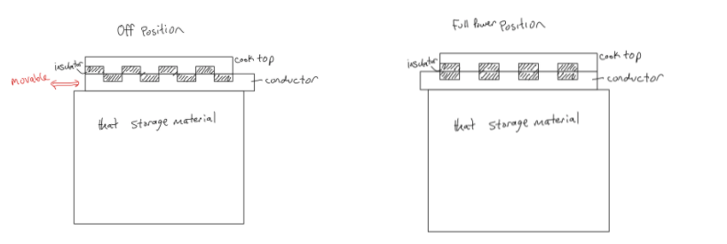

# Design Thinking and Rapid Prototyping Term Project
### Lucas Marden
[Home](https://lmarden.github.io/rapid-prototyping/)   

## Week 5
In the fifth week, the class split up into three teams, to start tackling some of the specific challenges of the project. The teams are: Energy Capture, Energy Storage, and Cooking. The teams worked independently and came together at the end of the week to discuss advances they had made, and find out more about each group's preferences. I am on the Energy storage team, and our presentation has been linked below.

### Energy Storage 
The main focus of the energy storage team so far has been on the types of materials that can be used to store heat for later use. Heat storage methods can generally be divided into three categories: sensible, latent, and chemical. Sensible heat storage simply involves heating a material without inducing a phase change. This is not ideal for cooking, as the material does not remain at a constant operating temperature. Latent heat storage involves a phase change, which could be solid-liquid, solid-solid, or even liquid-gas. This method allows the heat storage material to remain at constant temperature, because a phase change must occur at a constant temperature. Chemical energy storage involves heating up a chemical to cause an endothermic reaction to occur. From this "charged" state, heat can be released by allowing the reverse reaction (which is exothermic) to occur. This method does have the benefit of allowing for much longer-term storage of energy, but would likely be a bit more complex and possibly hazardous to implement and use. 

Based on these factors, the Energy Storge Team decided that latent heat storage would likely be the most appropriate method. This was agreed upon by most of the class, but the choice of material still represents a fairly large challenge. Many of the latent heat storage materials we have found as precedents are either toxic or otherwise unsafe for use in a cooking device. Lithium nitrate, for example, fits the criteria for cooking temperatures decided on by the Cooking Team. However, this material is fairly toxic to humans, and would likely need to be kept in a tightly-sealed container. This introduces some design issues surrounding the heating of the heat storage material, since any intermediate steps or materials between the sun and the heat storage material represent an opportunity to lose energy. Other examples of possible latent heat storage materials include a [eutectic](https://en.wikipedia.org/wiki/Eutectic_system) mixture of sodium nitrate and potassium nitrate, zinc, xylitol, and erythritol.

#### Heat Transfer to Cooktop
Another topic of much discussion during the presentations was on how heat will be transferred from the storage material to the cook top. The simplest solution is to simply cook on the storage material, but this severely limits the material choices for heat storage (not to mention likely requiring sensible heat storage to be used, rather than latent). Another possible solution is diagrammed below. In this system, there is a sheet of alternating insulators and conductors, which can be moved using a knob to allow more or less of the storage material with insulators. This allows for more control over the temperature, without needing to remove an entire (incredibly hot) insulating sheet from the stove during use. This would also allow for an easy way to have a "low temperature" region of the cooktop, which was a fairly important criterion to the Cooking Team. This could be done by increasing the number of insulators in one area, so that, for example, more than 50% of the sheet is made of insulators, even in the "on" mode.  
 

#### Energy Storage Team Pin-up 1
Please view the presentation [here](https://docs.google.com/presentation/d/1L8QO2hFe0YEIImoED_7eao3nOXle57VCv-ufpZuIcac/edit?usp=sharing). The presentation goes into a bit more detail about each type of heat storage, and provides more examples of materials that could be used for each type of heat storage.
