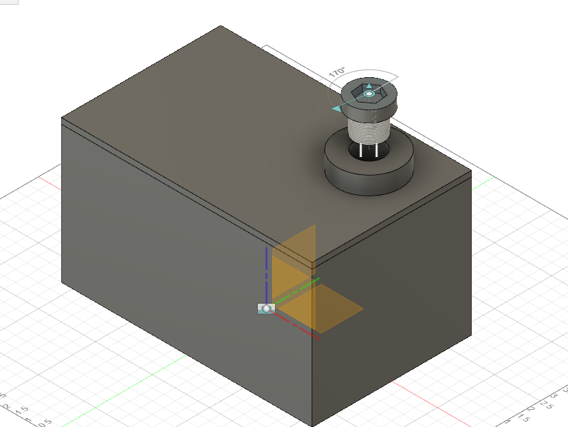

# Design Thinking and Rapid Prototyping Term Project
### Lucas Marden

## Week 6
This week involved a guest lecture on systems thinking and marked the class' first jump into actual prototyping! I spent a bit of time learning how to use [Autodesk Fusion 360](https://www.autodesk.com/products/fusion-360/overview), which was an exciting new experience for me, as I previously had no experience in CAD modeling.

### Systems Thinking
The systems thinking guest lecture by MIT's NEET Program Lecturer and Curriculum Designer [Rea Lavi](https://neet.mit.edu/community/leadership) gave a brief introduction to systems thinking. This type of thinking focuses on systems holistically, and on the interactions between components, rather than on the specific function within one component (where on might be better off to apply analytical thinking techniques). One commonly used framework to think about systems thinking is the SAFO framework, which includes system architecture, function, and outcomes. The picture below analyzes a coal-based power plant using the SAFO framework.

### Sodium & Potassium Nitrate Boxes
Our class also received two thermal heat batteries from MIT NSE Professor [Mike Short](https://web.mit.edu/nse/people/faculty/short.html). These boxes are constructed from stainless steel (which we approximate to be .25" thick on all sides) and have the following dimensions: 6" x 7" x 11". On one side of each box (one of the 11" x 7" sides), there is a threaded insert and screw, so that salt can be poured into the box after welding. Both boxes are filled with a mixture of sodium nitrate and potassium nitrate, although the mixing proportions are not currently known. One of the boxes has already been put through a heating process, and thus has some coloration (due to oxidation) on its surface. This box also had a small hole drilled through the center of its screw, to eliminate any chance of pressure buildup during heating. These devices may be used as is, or modified for use in our solar cooker, or we may simply base our thermal battery designs on these. A few images of the box are shown below.

 
 

### CAD Model of Thermal Battery
After a brief tutorial on Fusion360, I decided to try learning the software by starting a simple project (I stand by this technique, it greatly improved my understanding of object-oriented programming and Python, but I digress). The simple project was to model the thermal batteries given to use. This was a perfect beginner project because it started off very simple (just a box with 6 sides and no movement) to slightly more complex (screw threads and simultaneous rotational and translational movement of the screw). I got fairly familiar with the common commands in Fusion360, and became much more comfortable with the workflow of designing in Fusion360. I have attached a few screenshot of this model below.

### CAD Model Of Heat Transfer Mechanisms
After modeling the thermal battery, I made first draft designs of two different heat transfer mechanisms that we had discussed in class, one of which involved horizontal motion, and one of which involved vertical motion. I modelled each of these first on their own (as separate files), then combined each with the model of the battery, to show how all of the parts could connect. I will only show the combined versions here, in order to avoid redundance. The two mechanisms are described along with a video of their operation below.

#### Horizontal-Motion, Solid-State Heat Transfer Mechanism
The first heat transfer mechanism is composed of two layers; each layer consists of alternating sections of insulator (light gray, intended to be a ceramic) and conductor (dark gray, intended to be a metal). The bottom layer is grounded to the battery, but the top layer is free to move horizontally. This allows for a range of heat transfer rates; the mechanism will be in the "off" position when the two layers are perfectly misaligned, so that there are conductors blocking every possible mode of heat transfer, and will be in the "on position" when the layers are perfectly aligned, so that conductors make up 50% of the cross-sectional area. One can easily imagine a crank/handle that allows the user to move the top layer horizontally between the two positions. A video of the mechanism's function is attached below.

#### Vertical-Motion, Solid-State Heat Transfer Mechanism
The second heat transfer mechanism consists of a few more components, but still only has one set of moving parts. There are vertical conducting fins extending up from the battery, and extending down from the cooktop. These are all static; they should not move, as this greatly simplifies the design of the battery and cooktop holding mechanisms. In between these fins, there are components consisting of a conductor and an insulator. This pieces can move vertically in order to have greater or worse connection between the battery and cooktop. The "off" position is the bottom position of the sliding pieces, where all of the insulators are at the same height, thus forming one insulating sheet. The "on" position exists where equal amounts of the middle pieces' surface areas are on each of the bottom and top fins. This explanation sounds confusing, so please check out the video for a more clear demonstration! 

 

### Final Thoughts
This has been a very productive and exciting week. Looking forward, we plan to establish a collaborative Fusion360 project, shared between all members of the class, so that we can share files and designs more easily. We also plan to build and test some prototypes of the heat transfer mechanisms (testing heat transfer efficiency and capabilites with a hot plate). Also, at some point, we will be either building more thermal batteries, with either the same or a slightly different design; this decision will be based on saftey concerns and some physical tests (actual heat cycling) of the current thermal batteries. 
