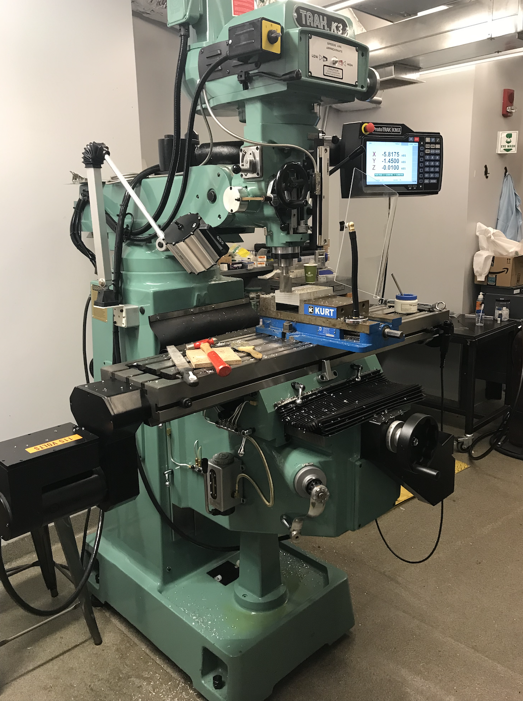
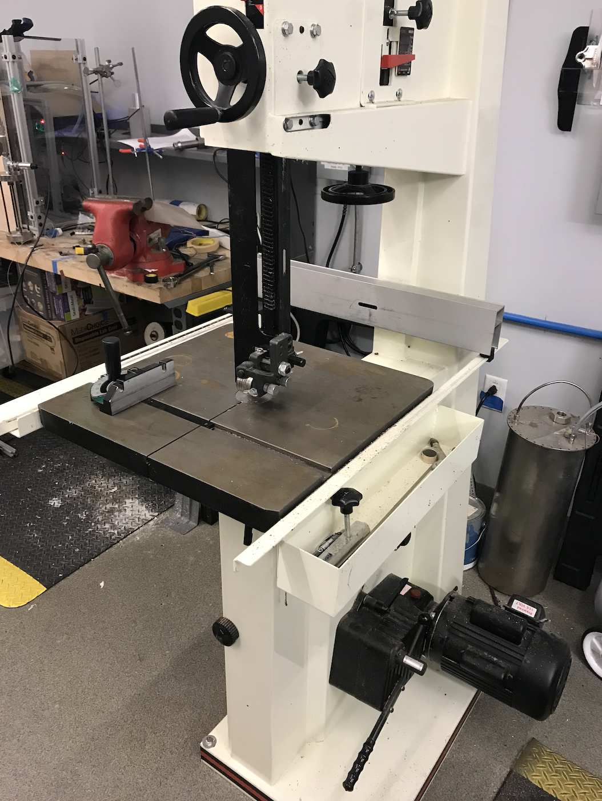
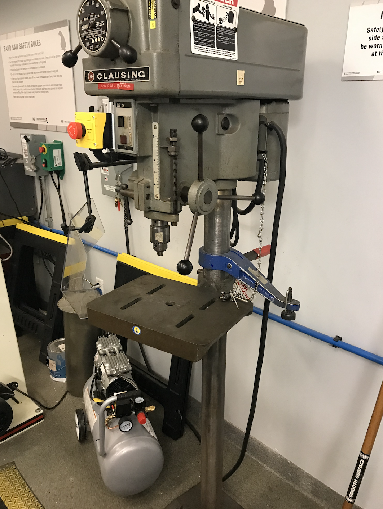
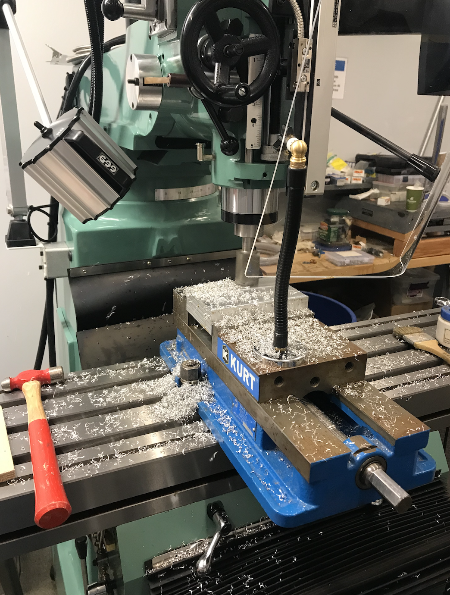

# Design Thinking and Rapid Prototyping Term Project
### Lucas Marden

## Week 7
The seventh week consisted of more hands-on activities than in the past few weeks! The Energy Storage team is currently focusing on prototyping one proposed method of heat transfer from the thermal battery to the cooktop. We spent a bit of time in the prototyping shop at the beginning of the week, getting familiar with the tools at our disposal, and deciding on our design for the first prototype. Towards the end of the week, we received the materials to build the prototype, and started machining the aluminum pieces.

### Equipment
We were introduced to three min pieces of equipment this week. The first machine (which is entirely new to me) is a milling machine. Specifically, we are using a Trak K3 mill, which has been retrofitted with a digital readout and driver system. The mill is pictured below. The mill can be used to ensure that workpieces are flat on all sides (or "faced"), to cut horizontal slots in the workpiece, to cut holes in the workpiece, and for several other operations that require high levels of precision. 

The second machine in our toolkit is the bandsaw. This machine consists of a cutting table and a continuously run blade; it allows for cutting of softer metals (specifically aluminum) with relative ease. The bandsaw will be used in our project to cut pieces to length; this is done in combination with measuring tools to ensure consistent, precise cuts. The bandsaw is shown below.

The third machine that we will use is the drill press. Its purpose is to cut vertical holes in a workpiece; though this job could be done more precisely by the milling machine, it is helpful to be able to separate the work among two different machines, so that there is not a constant holdup waiting for the availability of the milling machine. The drill press is pictured below.

### Progress in Machining
A lot of our effort this week was focused on learning how to safely operation the machines in the prototype shop, but we did get some time to actual machine our parts. I worked on facing the aluminum block, which will make up one side of the heat transfer mechanism. I was able to complete 5 of the 6 sides, which was a good introduction into the world of machining; I got to help troubleshoot a few issues, but by the end I was able to finish each side with relative ease. Below is a picture of the block being milled:

### A Note on CAD
This week, the design integration team set up a collaborative Fusion360 Team, and the class went over a brief tutorial in using the software. This ability to share designs and models will be very valuable, in order to see how all of the parts and components will fit together in the end.
