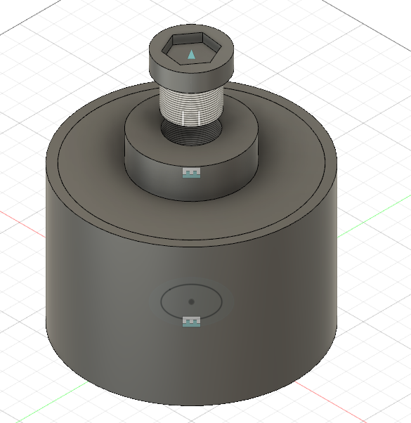
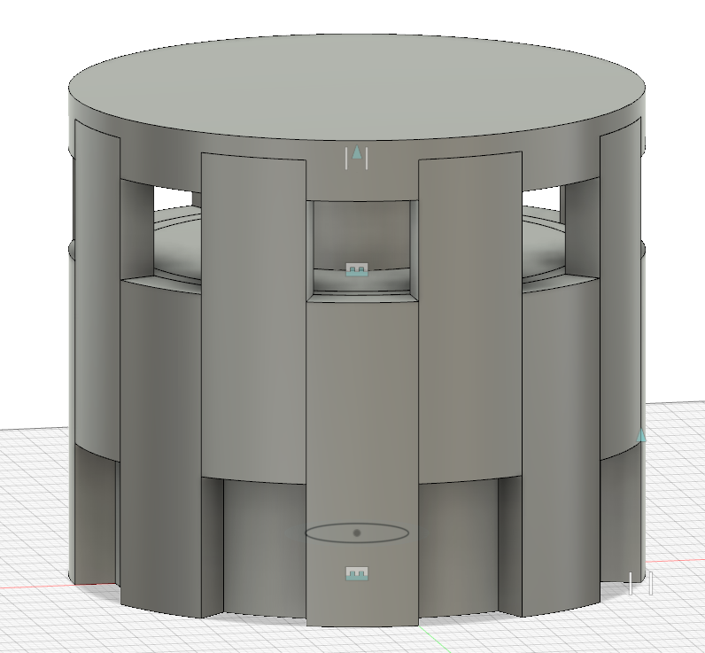

# Design Thinking and Rapid Prototyping Term Project
### Lucas Marden
[Home](index.md)

## Week 8
In the eighth week of class, the energy storage team continued to focus on prototyping a heat transfer mechanism to be tested for efficiency. This work is done in preparation for a mid-review, which is happening in the upcoming week; during this review, we will present our work to a group of individuals with backgrounds in similar fields to our work, and will hear their advice/critique for the project.

### Prototyping Progress
Most of the class time this week was spent in the prototyping shop. Personally, I used one day to focus on using the drill press and band saw to assemble the portion of the heat transfer mechanism constructed of aluminum bars. Along with another team member, I tried to develop a process to ensure that the holes drilled in adjacent bars would be aligned; this was somewhat imperfect, though, so one of our instructors is attempting to locate a tool (whose name I can not remember) to help with this issue.

I spent the other class day working with the mill; I was working on the other half of the mechanism, which we are manufacturing in a subtractive way. We did not get much time in the shop that day, but I did learn how to use an [edge finder](https://www.sme.org/technologies/articles/2019/august/finding-the-edge/). I centered the milling machine on the hole in the workpiece that had been cut the previous day, and managed to do one more pass over the hole that was previously cut, to clean up the edges.

Next week, I hope to spend some time finishing up this prototype, so that we can have a tangible product to display/present during the mid-review.

### CAD Modelling
Over the weekend, I spent a bit of time developing some new CAD models. Specifically, I worked based off of a discussion in class, where we focused on one of the problems with the current design: the rate of heat transfer. All models up until now have placed the heat transfer mechanism on top of the battery; this means that for heat to travel from the sides of the battery into the cooking surface, it would basically need to travel through the stainless steel container, and into the top surface, in order to be conducted. It is unlikely that there would be much conduction between the liquid salt and the top surface directly, as the box will probably not be entirely full for safety and pressure concerns. Thus, this method is incredibly inefficient. We thus reimagined the heat transfer mechanism, and decided that it would be much more reasonable to have heat transferred through the sides of the battery.

Based on this decision, we also discussed the possibility of redesigning the battery. In order to ensure symmetric, circular heating (similar to what consumers are used to in regular cooking appliances), we decided that a circular battery would make much more sense. The heat transfer mechanism could be placed around the edges of this circular battery, and leave space for the screw and cap on top of the battery (avoiding any concern of leaking that would be introduced if the cap were on the bottom of the battery). BAsed on these guidelines, I made two CAD models: the circular battery and the circular heat transfer mechanism. The two are shown below.

#### Circular Thermal Battery

#### Circular Heat Transfer Mechanism

