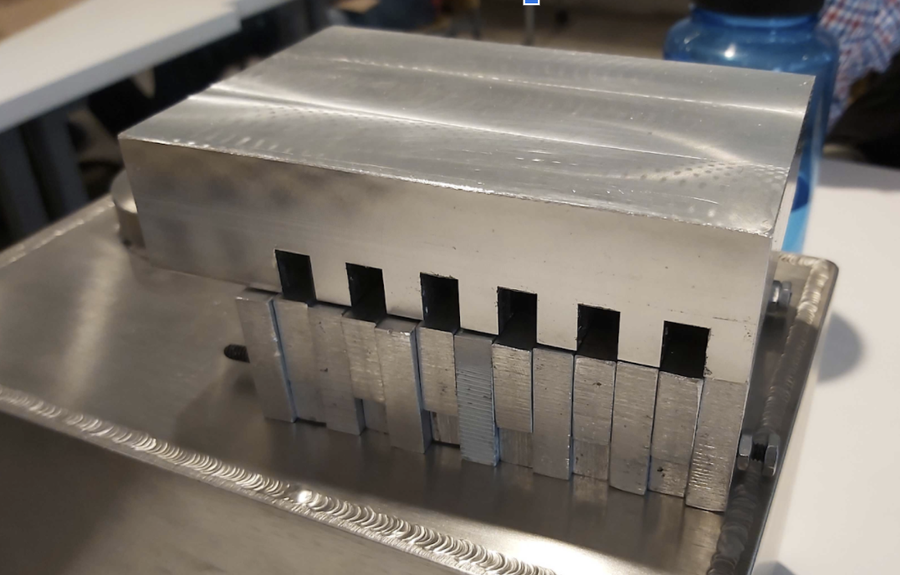

# Design Thinking and Rapid Prototyping Term Project
### Lucas Marden
[Home](https://lmarden.github.io/rapid-prototyping/)   

## Week 9
During the ninth week of class, our main goals were to prepare for and present at our mid-review. The mid-review consisted of presenting to a panel of four engineers who could help inform our design/prototyping process. The three teams which have remained intact this far in the class (energy collection, energy storage, and integration / solar tracking) each gave a presentation lasting 15-20 minutes, with about 10 minutes of discussion / questions after each.

### Preparations
In order to prepare for the mid-review, the energy storage team finished up our first prototype of a heat-transfer mechanism. This meant more time on the drill press, bandsaw, and milling machine. I spent most of my time working on milling slots in the aluminum block. I wasn't able to make a perfectly finished product, but I did at least one full pass on every slot, using a 3/8", 2-flute end mill. For a finished part, I would use a 4-flute end mill to make a few more passes over each slot, in order to ensure a smooth finish everywhere. However, since this part is not going to be used in the final product, it is likely unnecessary to do so. The prototype in its current state is pictured below:

A few descriptions of the image above: the top piece started as an aluminum block and had slots milled into it, while the bottom is constructed of aluminum bars which had holes drilled into them and were screwed together. In betweent the bars that are screwed together are the sliding bars, which are intended to be able to move between their current position (fully retracted) and touching the top block. In theory, the top block should be lifted slightly from the bars on the bottom, so that conduction does not occur in the "off" state, and heat loss is minimized when the stove is not operable.

### Observed Issues
The prototype is not perfect. Besides the slightly imperfect production (i.e. rough edges, imperfectly drilled holes, etc.) that come from beginners learning to prototype, the design itself has some fundamental issues. The biggest is likely the movability of the "sliding" bars. If the screws connection the rest of the aluminum bars are tightened, it becomes nearly impossible to move the sliding bars up and down. The obvious solution here is just to make the slots/gaps a bit wider. However, this risks imperfect contact, which is important for conduction. The best proposed solution is to basically cover all surfaces with conductive grease of some sort. This would allow for better movement and would likely help with the issue of conduction, but certainly not solve it. There does not appear to be a more effective solution without totally redesigning the heat transfer mechanism.

### Feedback from the Panel
The comments and discussion we had with the panel after our presentation were extremely productive and constructive. They offered a lot of expertise that can help inform our successive designs.

Starting first with the heat transfer mechanism, which has been our group's focus: the panel agreed with the above issue. They thought that conductive grease may represent a decent solution, but that the mechanism would likely be prone to jamming, and not very user-friendly. They were particularly happy about one mechanism that our group had previously decided against: the horizontal motion mechanism (pictured below).

I went into more detail on the exact function of this proposed mechanism in [Week 6](https://lmarden.github.io/rapid-prototyping/Week_6). The panelists preferred this mechanism because they thought it would be easier to operate and manufacture, avoiding a lot of the pitfalls of the current design. We will decide in the next week how to continue with this project - whether to continue with our current prototype, and get some data about its performance (this would likely be more useful if the class plans to continue working on this project after this semester), or to redesign our mechanism (preferable if we are trying to quickly get to something that resembles a solar grill). 

Another point made by the panelists was that the energy capacity of one of these salt boxes is likely insufficient for many of our cooking goals. Rather than being able to cook a full meal, the thermal battery might be able to make a pot of coffee. This probably wouldn't necessitate a total redesign of the chemical composition of the battery, but rather a redesign in the structure and number of batteries used in our grill. This presents its own challenges, which we will have to discuss as we move forward with the project.

Overall, it was a great learning experience to speak with some professional engineers who have experience with the exact challenges we are facing. 
